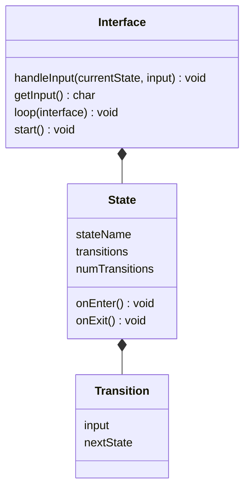

```mermaid
classDiagram
    Interface *-- State 
    State *-- Transition

    Interface : handleInput(currentState, input) void
    Interface : getInput() char 
    Interface : loop(interface) void
    Interface : start() void

    State : stateName
    State : onEnter() void
    State : onExit() void
    State : transitions
    State : numTransitions

    Transition : input
    Transition : nextState
```